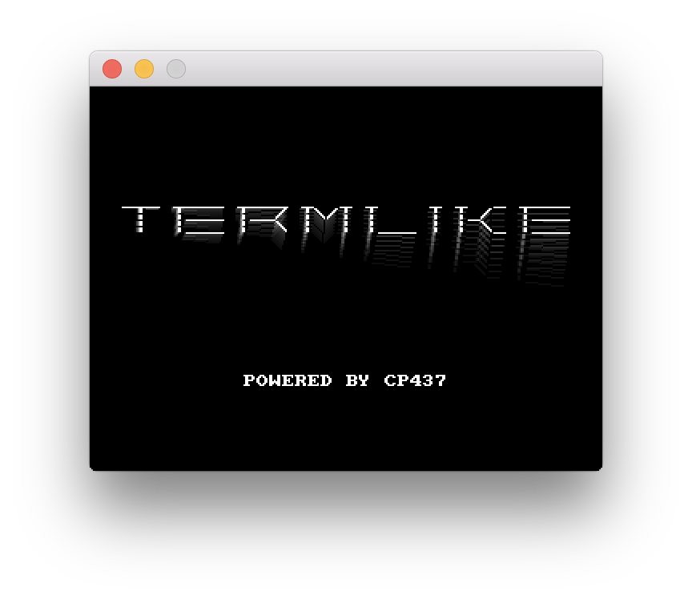

# Termlike

[](https://github.com/jhauberg/comply)

A low-profile library for building high-performance, and cross-platform games in the aesthetic of traditional text-based applications, but with the benefits of modern graphics technology.

The name *Termlike* is in reference to the [*Roguelike*](https://en.wikipedia.org/wiki/Roguelike) genre of games, which historically has roots in text-based terminals.

Termlike is written in **C99** and requires **OpenGL 3.3** or later.



### Limitations

Termlike specializes in *one* thing; getting character glyphs on the screen. As such, it has limitations.

**256 Glyphs**

Termlike *only* supports the 256 glyphs defined by [Codepage 437](https://en.wikipedia.org/wiki/Code_page_437), and provides a built-in font that resembles the one found on the original [IBM PC](https://en.wikipedia.org/wiki/IBM_PC).

There is no support for custom fonts or tiles, nor any plans for it.

**Display sizes**

There are only a few available display sizes (i.e. window dimensions). These select few were chosen as the best fits for the embedded font and are not customizable. Similarly, there is no support for resizable windows.

**Not a terminal**

Termlike is not a terminal, nor is it a [terminal emulator](https://en.wikipedia.org/wiki/Terminal_emulator).

There is no concept of a grid of cells for glyphs to be put into, or a cursor from which you print. There's just a surface full of pixels.

As such, there are no restrictions on where glyphs can be put on the display surface, as long as the position can be represented as a pixel coordinate.

## Usage

Termlike is intended to be used as a static library that you link into your program.

See [Building](#building) for instructions on building the project from source.

### Example

Here's the smallest program that just runs a terminal window until user presses <kbd>Esc</kbd>:

```c
#include <termlike/termlike.h>

int
main(void)
{
    term_open(defaults("Termlike"));

    while (!term_is_closing()) {
        if (term_key_down(TERM_KEY_ESCAPE)) {
            term_set_closing(true);
        }
        
        term_run(TERM_FREQUENCY_DEFAULT);
    }
    
    term_close();
    
    return 0;
}
```

Take a look in [examples](/example) for more usage samples.

## Similar projects

Termlike may not suit your tastes or requirements, in that case, there's several other options.

Here's a few good ones:

* [`BearLibTerminal`](http://foo.wyrd.name/en:bearlibterminal) by Alexander Malinin (cfyzium)
* [`SadConsole`](https://github.com/thraka/sadconsole) by Andy De George (Thraka)
* [`Zircon`](https://github.com/Hexworks/zircon) by Hexworks
* [`doryen-rs`](https://github.com/jice-nospam/doryen-rs)

## Dependencies

A few dependencies are required to keep the scope of the project down. Most of these are small and already included as part of the repository (see [external](/external)).

**Included as a submodule:**

* [`glfw/GLFW3`](https://github.com/glfw/glfw) handles **cross-platform window creation**

**Included:**

* [`skaslev/gl3w`](https://github.com/skaslev/gl3w) for **OpenGL Core Profile** header loading
* [`datenwolf/linmath`](https://github.com/datenwolf/linmath.h) provides **math functions**
* [`nothings/stb_image`](https://github.com/nothings/stb) provides **image loading** capabilities (png)
* [`skeeto/branchless-utf8`](https://github.com/skeeto/branchless-utf8) provides **UTF8 decoding**

## Technicalities

**CPU Intensive**

Termlike is implemented as a typical, graphically intensive, game engine, which means taking as much advantage of the hardware as possible; all the time, and never stopping.

For example, there is no sleeping or idling between frames, to throttle CPU usage. It will run as fast as it can, all the time, to be as responsive as possible- which is a bane for battery-powered laptops with loud fans, but a boon for games with a lot of animation or a focus on action. *You can, however, reduce CPU impact significantly by enabling vsync*.

Similarly, Termlike will draw every frame from a blank slate, over and over; there is no concept of only drawing dirty or changed parts of the screen; nor can you control *when* a draw should be committed.

**Sprite batching**

Behind the scenes, Termlike performs glyph rendering by utilizing what is commonly known as *sprite batching*. This is a very GPU-efficient technique that lets a program make as few draw calls as possible.

**Command buffering**

Whenever a program calls any of the `term_print` functions, Termlike does not immediately render the character glyphs. Instead, the call is buffered as a *command* that contains all the necessary information to make the glyph appear as expected.

Termlike will accumulate all these commands for a single frame and trigger them only when appropriate (and in the expected order). This allows a program to not worry about when or where it issues print commands, and is a requirement to guarantee correct layering/ordering when coupled with sprite batching (without it, glyphs on top could be flushed before those below).

## Building

Termlike is a cross-platform library. However, it is also a project that i'm only working on in my sparetime, mainly on a single platform; as such, this imposes some difficulties when it comes down to actually building the project.

### Enter CMake

Since every platform has its own preferable development environments and compilers, it would be a significant task to maintain a working project state for each supported platform by hand.

To reduce the effort required to make this work, Termlike uses [CMake](https://cmake.org).

This nifty tool generates the build files you expect on your preferred platform, be it macOS, Windows or Linux; it just needs to know which files should be compiled, as well as how they relate to each other (see [CMakeLists.txt](CMakeLists.txt))- it will figure out the rest automagically.

### Cloning the repository

First of all, however, make sure to clone the repository recursively so that it also pulls in the *glfw* dependency (which is only included as a *git submodule*):

```console
$ git clone --recursive https://github.com/jhauberg/termlike.git
```

This should leave you with all the sources necessary to let CMake generate build files.

### Generating build files

To generate build files, make your way to the root of the repository and run CMake:

```console
$ cd termlike
$ cmake .
```

#### Debug builds

You can explicitly specify whether CMake build files should define the `DEBUG` symbol. For example, to make a debug build:

```console
$ cmake -DCMAKE_BUILD_TYPE=Debug .
```

### Building the library

Depending on your platform, CMake should now have generated a project, solution or a script that can build the required dependencies, a static Termlike library and all the executable examples.

For example, on macOS and Linux, you're provided with a `Makefile`:

```console
$ make
```

On Windows, you typically end up with a Visual Studio solution.

## License

Termlike is a Free Open-Source Software project released under the [MIT License](LICENSE).
